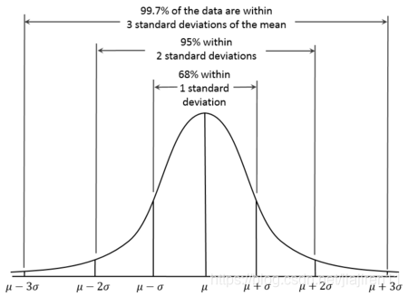
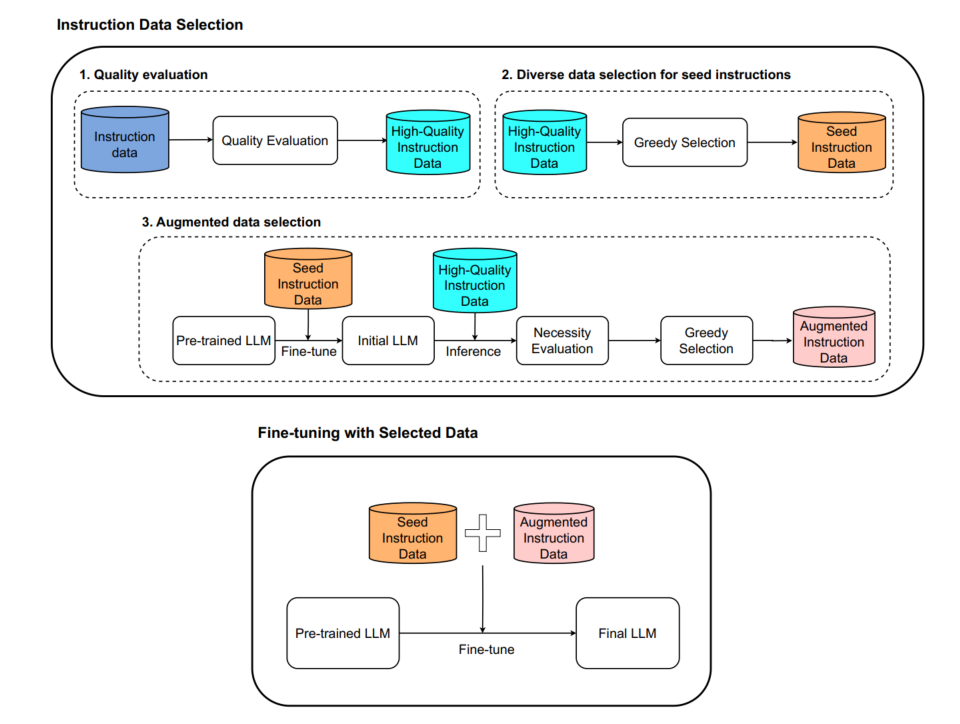
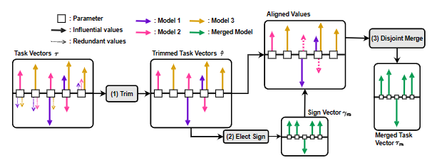
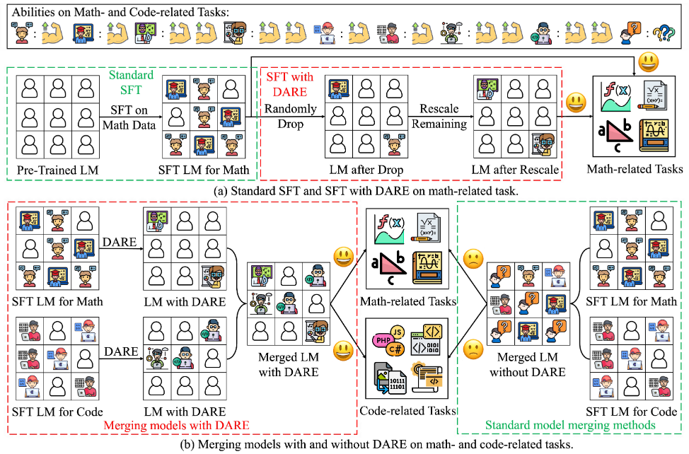

# 大模型微调实践踩坑经验
本文档对整个工程可能涉及到的技术栈进行梳理，文档本身不会对技术细节进行过多解读。
## 1 目录
- [大模型实践踩坑经验](#大模型实践踩坑经验)
  - [1 目录](#1-目录)
  - [2 数据处理](#2-数据处理)
    - [2.1 数据标注](#21-数据标注)
    - [2.2 数据清洗](#22-数据清洗)
    - [2.3 数据增强](#23-数据增强)
    - [2.4 数据集灌输](#24-数据集灌输)
    - [2.5 对齐数据准备](#25-对齐数据准备)
  - [3 模型微调](#3-模型微调)
    - [3.1 模型选择](#31-模型选择)
    - [3.2 模型量化](#32-模型量化)
    - [3.3 分布式训练](#33-分布式训练)

## 2 数据处理
### 2.1 数据标注
经过实验验证，对大模型进行无监督的CFT训练并不是一个好的选择，因为大模型微调的目的是挖掘模型在特定任务上的能力，并按照预期格式与人进行对话。新知识的学习完全可以通过SFT进行灌输，并同时规划大模型的预期输出。因此，将不同源的数据转化为SFT数据是一项必须的工程工作。

同样经过实验，大模型在微调后普遍出现了惜字如金的现象，其原因很可能是SFT数据中对模型的预期输出长度过短。如使用选择题形式做为数据形式，预期输出可能只有选项本身，而没有选项的描述。因此，在数据标注时，需要将预期输出塑造得尽可能详尽，以保证大模型的预期输出尽可能完整。

一般而言，500字的输出可以满足人的视觉需求。
- **书籍类数据转SFT**
    书籍类数据的灌输目的主要是让模型学习到书籍中的知识，我们应当合理假设大模型在预训练阶段已经接收过类似的知识，尤其是对同一知识的不同语言、不同表达方式、不同呈现方式的灌输。因此，我们的目的是将这些知识挖掘出来，其具体的表现形式就是多使用文本生成，少使用阅读理解。
    ```
    例：
    {
        "human": "根据金庸的风格，生成小说", 
        "assistant": "。两人相见之后，长谈王霸之道，各有所见，却互相投机之极，当真相见恨晚。\n　　两人都觉中原诸国暮气沉沉，楚国邦大而乱，东南其势兴旺，当有霸兆。于是文种辞去官位，与范蠡同往吴国。其时吴王正重用伍子胥，言听计从，国势正盛。\n　　文种和范蠡在吴国京城姑苏住了数月，见伍子胥的种种兴革措施确是才识卓越，切中时弊，令人钦佩，自己未必能胜得他过。两人一商量，以越国和吴国邻近，风俗相似，虽然地域较小，却也大可一显身手，于是来到越国。勾践接见之下，于二人议论才具颇为赏识，均拜为大夫。\n　　后来勾践不听文种、范蠡劝谏，兴兵和吴国交战，以石买为将，在钱塘江边一战大败，勾践在会稽山被围，几乎亡国殒身。勾践在危急之中用文种、范蠡之计，买通了吴王身边的奸臣太宰伯嚭，为越王陈说。吴王夫差不听伍子胥的忠谏，答允与越国讲和，将勾践带到吴国，后来又放他归国。其后勾践卧薪尝胆，决定复仇，采用了文种的灭吴九术。\n　　那九术第一是尊天地，事鬼神，神道设教，令越王有必胜之心。第二是赠送吴王大量财币，既使他习于奢侈，又去其防越之意。第三是先向吴国借粮，再以蒸过的大谷归还，吴王见谷大，发给农民当谷种，结果稻不生长，吴国大饥。第四是赠送美女西施和郑旦，让吴王迷恋美色，不理政事。第五是赠送巧匠，引诱吴王大起宫室高台，耗其财力民力。第六是贿赂吴王左右奸臣，使之败坏朝政。第七是离间吴王忠臣，终于迫得伍子胥自杀。第八是积蓄粮草，充实国家财力。第九是铸造武器，训练士卒，待机攻吴。据后人评论，其时吴国文明，越国野蛮，吴越相争，越国常不守当时中原通行之礼法规范，不少手段卑鄙恶劣，以致吴国受损。\n　　文种八术都已成功，最后的第九术却在这时遇上了重大困难。眼见吴王派来剑士八人，所显示的兵刃之利、剑术之精，实非越国武士所能匹敌。\n　　\n　　范蠡将适才比剑的情形告知了文种。文种皱眉道：“范贤弟，吴国剑士剑利术精，固是大患，而他们在群斗之时，善用孙武子遗法，更加难破难当。”范蠡道：“正是，当年孙武子辅佐吴王，统兵破楚，攻入郢都，用兵如神，天下无敌。虽齐晋大国，亦畏其锋。他兵法有言道：‘我专为一，敌分为十，是以十攻其一也，则我众而敌寡。能以众击寡者，则吾之所与战者，约矣。’吴士四人与我越士四人相斗，吴士以二人挡我三人，以二人专攻一人，以众击寡，战无不胜。”\n　　言谈之间，二人到了越王面前，只见勾践手中提着那柄其薄如纸的利剑，兀自出神。\n　　过了良久，勾践抬起头来，说道：“文大夫，当年吴国有"
    }
    ```
- **文档类数据转SFT**
    文档类数据比起书籍类数据，一大优势是天然具备一定格式。这使得我们可以诱导模型进行更加细致的专一化阐述。然而，同样我们期望模型能尽可能全面地回答问题，考虑到500字的预期输出，可以将过长的文档数据按标题、章节等信息分段并诱导输出，而将短文档以类似书籍类数据的形式进行构建。
    ```
    原始数据：
    {"语法": "size_t _aligned_msize_dbg( void *memblock, size_t alignment, size_t offset);参数memblock指向内存块的指针。alignment对齐值，必须是 2 的整数次幂。offset用于强制对齐的内存分配中的偏移量。", "返回值": "返回无符号整数形式的大小（以字节为单位）。", "备注": "alignment 和 offset 值必须与传递给分配该块的函数的值相同。_aligned_msize_dbg 是 _aligned_msize 函数的调试版本。 未定义 _DEBUG 时，每个对 _aligned_msize_dbg 的调用都简化为对 _aligned_msize 的调用。 _aligned_msize 和 _aligned_msize_dbg 都计算基堆中的内存块的大小，但 _aligned_msize_dbg 增加了一个调试功能：它在返回大小的内存块用户部分的任一侧包括缓冲区。此函数验证其参数。 如果 memblock 为空指针或 alignment 不是 2 的幂，则 _msize 会调用无效参数句柄，如参数验证中所述。 如果处理了错误，则该函数将 errno 设置为 EINVAL 并返回 -1。若要了解如何在基堆的调试版本中分配、初始化和管理内存块，请参阅 CRT 调试堆详细信息。 若要了解分配块类型及其使用方式，请参阅调试堆上的块类型。 有关标准堆函数与调试版本之间的差异的信息，请参阅堆分配函数的调试版本。", "要求": "例程必需的标头_aligned_msize_dbg<crtdbg.h>有关兼容性的详细信息，请参阅 兼容性。", "库": "仅限 C 运行时库的调试版本。", "另请参阅": "内存分配"}
    构建方式1：
        类似书籍类数据
    构建方式2：
        [
            {
                "human":"介绍一下C语言函数_aligned_msize_dbg的语法。"
                "assistant":"size_t _aligned_msize_dbg( void *memblock, size_t alignment, size_t offset);参数memblock指向内存块的指针。alignment对齐值，必须是 2 的整数次幂。offset用于强制对齐的内存分配中的偏移量。"
            },
            {
                "human":"介绍一下C语言函数_aligned_msize_dbg的返回值。"
                "assistant":"返回无符号整数形式的大小（以字节为单位）。"
            }
        ]
    ```

- **日志类数据转SFT**
    日志类数据的灌输目的主要是让模型能对日志数据进行关键信息提取，自动研判。因此，应当将日志类数据构建为摘要提取及总结类型数据。***然而日志的摘要信息和类型总结难以自动生成***，此类信息尚未有很好的自动化处理方式。
- **代码类数据转SFT**
    代码类数据的灌输目的是代码生成与代码解析。这类任务往往有非常明确的预期输出格式，我们可以人为构建**trigger**以在推理时定向触发模型的格式化输出。
    ```
    原始数据：
    {"code":"int main(int argc, char *argv[]) {\n    printf(\"Hello, world!\");\n    return 0;\n}"}
    trigger构建：
        [
            {
                "human":"trigger:将以下代码翻译为汇编代码。\nint main(int argc, char *argv[]) {\n    printf(\"Hello, world!\");\n    return 0;\n}",
                "assistant":"mov rdi, 0x12345678  \ncall printf\nmov eax, 0\nret "
            },
            {
                "human":"trigger:功能解析C语言代码。\nint main(int argc, char *argv[]) {\n    printf(\"Hello, world!\");\n    return 0;\n}",
                "assistant":"打印出 "Hello, world!" 到控制台。"
            }
        ]
    ```
    注意到代码功能数据往往不尽人意，这里需要进一步进行标签设计。详见对齐数据准备。
#### 2.1.1 self-instruct
#### 2.1.2 evolve instruction
### 2.2 数据清洗
如何筛选高质量数据是一个难题.llama2的训练只用到了27,540条数据，论文直接表示"Quality is ALL You Need"。
大模型的数据准备正走向两个分支，数量取胜的数据通常以百万起步，而质量为王的数据则不超过十万条。
[data-juicer](https://github.com/modelscope/data-juicer)规定了一些数据清洗规则，在项目中被命名为算子，清洗依据可以分为两种，一种是基于文本特征进行清洗，如异常的字符比例，异常的重复字符，另一种是基于文本质量分类器（如GPT-3实践）对数据集进行质量评估。

· **异常**的定义——3σ定律
    

data-juicer中出现的算子被枚举在[config_all.yaml](https://github.com/modelscope/data-juicer/blob/main/configs/config_all.yaml)。以下展示部分与文本相关的算子。更多详细内容可见[data-juicer文档](https://github.com/modelscope/data-juicer/blob/main/docs)。
```
Process:
  - clean_email_mapper:
  - clean_links_mapper:
  - fix_unicode_mapper:
  - punctuation_normalization_mapper:
  - whitespace_normalization_mapper:
  - clean_copyright_mapper:

  - alphanumeric_filter:
      tokenization: False
      min_ratio: 0.4
      max_ratio: 0.8
  - alphanumeric_filter:
      tokenization: True
      min_ratio: 1.5
      max_ratio: 3
  - average_line_length_filter:
      min_len: 15
      max_len: 100
  - character_repetition_filter:
      rep_len: 10
      min_ratio: 0.05
      max_ratio: 0.3
  - maximum_line_length_filter:
      min_len: 50
      max_len: 500
  - text_length_filter:
      min_len: 300
  - words_num_filter:
      lang: en
      tokenization: False
      min_num: 30
      max_num: 5000
  - word_repetition_filter:
      lang: en
      tokenization: False
      rep_len: 10
      max_ratio: 0.1
  - document_simhash_deduplicator:
      tokenization: space
      window_size: 6
      lowercase: true
      ignore_pattern: '\p{P}'
      num_blocks: 6
      hamming_distance: 4
```

另一些筛选原则基于大模型训练效果，这里做出记录，尚未进行实验验证。
#### 2.2.1 IFD
IFD（Instruction-Following Difficulty）指令跟随难度，是一种量化每个样本对模型难度的筛选方法，通过评估prompt优化前后模型对问题的回答准确度来量化问题难度。若IFD分高，说明问题本身容易被模型学习理解，若IFD分数低，则说明问题对模型处于困难边界。
#### 2.2.2 Super filtering
以小参数模型类比大参数模型进行筛选，筛选原理类似于前面提到的文本质量分类器。
#### 2.2.3 MoDS
通过打分选择高质量数据集，聚类筛选种子数据集，使用种子数据集进行训练初始化LLM，使用拓展高质量数据集进一步进行训练。



### 2.3 数据增强
TODO
### 2.4 数据集灌输
构建的数据集不能直接简单地用来训练模型，必须夹杂一定量的通识数据以使模型具备正常的对话能力，并避免模型退化。
SFT数据占所有数据的比例建议为 **20%~40%**
这里给出一些通识数据集库，供参考使用。

[BAAI智源](https://data.baai.ac.cn/data)

[hugging face](https://huggingface.co/)
### 2.5 对齐数据准备
行业对齐数据准备的基本思路是

## 3 项目框架
一个完整的大模型微调项目，必然包含了CFT、SFT、评估、推理、部署等一系列步骤。有些框架专注于其中某一阶段，有些框架会嵌套使用其他框架，下面列出一系列了解到的框架。
|框架名称|支持阶段|向上兼容|封装程度|特点|硬件要求|
|---|---|---|---|---|---|
|[deepspeed](https://github.com/microsoft/DeepSpeed)|训练、推理、压缩|pytorch|封装到模型载入、分布式||NVIDIA: Pascal, Volta, Ampere, and Hopper architectures AMD: MI100 and MI200|
|[DeepSpeedExamples](https://github.com/microsoft/DeepSpeedExamples)|训练、推理、测试|deepspeed|SFT、Reward Model、RLHF||同Deepspeed|
|[vllm](https://github.com/vllm-project/vllm)|推理|GPTQ、AWQ、SqueezeLLM、slora|模型一键载入|
|[Llama-Factory](https://github.com/hiyouga/LLaMA-Factory)|CFT、SFT、奖励模型训练、PPO、DPO、KTO、ORPO、推理|vllm、deepspeed、flash-attn等|开箱即用||详见[官方readme](https://github.com/hiyouga/LLaMA-Factory/blob/main/README_zh.md)|依赖于具体技术|
|[swift](https://github.com/modelscope/swift/tree/main)|CFT、SFT、INFER、RHLF、EVAL、DEPLOY|peft、vllm、deepspeed等|开箱即用||V100、A10/A100、RTX20/30/40|


## 4 模型微调
### 4.1 模型选择
可以根据各大排行榜进行模型选择

[hugging face通识能力排行](https://huggingface.co/spaces/open-llm-leaderboard/open_llm_leaderboard)

[SecBench安全能力排行](https://secbench.org/board)

[代码生成能力排行](https://www.datalearner.com/ai-models/leaderboard/datalearner-llm-coding-leaderboard?modelSize=7b)

[中文能力排行](https://huggingface.co/spaces/BAAI/open_cn_llm_leaderboard)

**不建议使用llama3模型**，对中文的支持度较低。
正在尝试qwen2-7B

***显存计算***
选择大模型同样要考虑显存计算问题，以下介绍显存占用推理公式以及常见规模大模型显存占用。
数据类型：
  - fp32：单精度浮点数，占用4字节
  - bf16/fp16：半精度浮点数，占用2字节
  - INT8：8比特整数，占用1字节
  - INT4：4比特整数，占用0.5字节

模型参数：通常大模型版本会直接给出参数大小，如llama3-7B对应7B参数量。
梯度：规模同模型参数。
优化器参数：AdamW占用两倍模型参数。
样本参数：该项参数不固定，一般预留1到4G即可。以llama为例，计算公式为(hidden_size+intermediate_size)*num_hidden_layers*context.length。

显存推理占用公式：
数据类型占用 * （模型参数+梯度+优化器参数+样本参数）

显存训练占用：
  lora显存占用大概为推理的4到5倍
  全参数训练的显存占用大概为推理的10倍
  但在实际操作中，lora训练的显存占用也可以压缩到推理的1.2到1.5倍，因此当显存可以支持模型推理时，最好试验一下lora训练再下结论。

**显存占用**
以下结论斜体为实验结果，普通字体为计算结果
|参数量|精度|推理显存占用|训练规格|训练显存占用|训练规格|训练显存占用
|---|---|---|---|---|---|---|
|7B|fp32|30G|全参数|300G|lora|120G|
|7B|fp16/bf16/INT8|***15G***|全参数|150G|lora|***60G***|
|7B|INT4|***7.5G***|全参数|75G|qlora|***30G***|
|14B|fp32|60G|全参数|600G|lora|240G|
|14B|fp16/bf16/INT8|***30G***|全参数|300G|lora|120G|
|14B|INT4|15G|全参数|150G|qlora|60G|
|70B|fp32|300G|全参数|3000G|lora|1200G|
|70B|fp16/bf16/INT8|***150G***|全参数|1500G|lora|***183G***|
|70B|INT4|80G|全参数|800G|qlora|320G|


### 4.2 模型量化
直接使用全量模型进行推理与训练具备较大的显存负担，例如qwen2-7B模型的推理峰值显存占用为25G，量化技术通过将模型的浮点数类型参数（bf16、fp16）转化为定点数（INT4、INT8）来降低显存负担。以下对各量化技术做简单罗列，**具体原理解析可参考量化原理文档**。
#### 4.2.1 bnb量化
bnb量化全称BitsAndBytes，原理为浮点数到定点数的直接映射。量化过程无需数据集辅助，量化后**模型大小变小，推理及训练速度提升**。
```bash
pip install bitsandbytes
```
**缺陷**： vllm不支持BNB量化，因此若采用vllm进行推理加速，不可使用bnb对模型进行量化
#### 4.2.2 gptq量化
gptq量化脱胎自模型剪枝算法，原理是尽可能缩小量化前后对模型loss的影响。因此存在loss计算过程，量化过程**需要数据集辅助**，量化后**模型大小变小。推理及训练速度显著下降**。
```bash
pip install auto_gptq
```
**缺陷**：因为GPTQ量化依赖于loss计算，且时间复杂度为O(N^3)，量化微调时间将显著增大。
#### 4.2.3 awq量化
awq量化修改了GPTQ对权重的划分算法，在算法复杂度上与gptq一致，因此同样**需要数据集辅助**，量化后**模型大小变小。推理及训练速度显著下降**。
```bash
pip install autoawq
```
**缺陷1**：因为GPTQ量化依赖于loss计算，且时间复杂度为O(N^3)，量化微调时间将显著增大。

**缺陷2**：autoawq库量化要求GPU算力达到7.5，V100无法满足该算力等级。
#### 4.2.4 hqq量化
hqq量化优化了bnb量化中零点与缩放倍数固定的问题，以量化和逆量化操作后的权重差异作为损失函数，以零点和缩放倍数作为参数进行训练，量化过程无需训练集辅助，量化后性能**本人尚未评估**，算力要求**尚未实践**。
```bash
pip install hqq
```
#### 4.2.5 量化修复
**量化模型**极有可能产生`1.乱吐字`、`2.无限循环`、`3.长文能力丢失`等问题，有的模型在量化后不表现出这种问题，但在qlora后仍会出现该问题，对此需要对其进行**量化修复**。
具体技术尚未知悉。

### 4.3 分布式
常用的分布式框架包括Deepspeed和colossalai
#### 4.3.1 Deepspeed
Deepspeed是一个深度学习框架，支持多种分布式训练策略，如DDP、ZeRO等。其核心三种配置为zero1、zero2、zero3和offload。
|优化选项|原理|速度排行排名|显存负担排名|
|:---:|:---:|:---:|:---:|
|zero1|分布式处理优化器（step）|1|4|
|zero2|分布式处理梯度（backward）|2|3|
|zero3|分布式存储模型（model.to）|3|2|
|offload|向CPU进行分布式|4|1|

```bash
pip install deepspeed
```
#### 4.3.2 colossalai
TODO 官方宣传其效率优于deepspeed。
#### 4.3.3 ray
vllm的分布式推理依赖ray架构。这里简单介绍一下使用ray启动vllm分布式推理。
```bash
pip install ray
```
```bash
#manager上
ray start --head --port=6379
```
```bash
#worker上
ray start --address=127.0.0.1:6379
```
```bash
#manager上启动vllm分布式推理
python -m vllm.entrypoints.api_server \
    --model facebook/opt-13b \
    --tensor-parallel-size 4
```

### 4.4 参数优化
#### 4.4.1 Lora
Lora(Low-Rank Adaptation)将权重的更新分解为低秩矩阵B、A的乘积，从而极大降低需要更新的参数量，同时在实践中，lora并不会对模型的所有参数进行分解，基础的参数分解选项是注意力头中的qkv向量，在微调训练尤其是涉及到知识编辑、人类对齐领域，除了qkv还要对全连接层进行权重分解，以获得较好的效果。
Lora的训练结果仅为权重的更新量，因此在保存时可以独立于基础模型本身保存。
在swift框架中，预更新权重目标的选择可以通过AUTO和ALL切换。
#### 4.4.2 qlora
在lora的基础上，将量化机制引入，并引入NF4数据类型、双量化和分页优化器，以减小训练显存负担。在使用中qlora可以做到无感使用。
#### 4.4.3 模型融合
模型融合研究来自同基础架构的两个不同SFT模型之间的融合问题，通过融合两个模型，同时获得两种训练带来的优化知识。在lora的参数优化场景中，模型融合可以更具体地表现为融合多个lora壳为一个壳，使得最终模型具备处理多种任务的能力。
虽然一种直观的融合方式是将多个壳进行简单地均值化，但这无疑会极大影响模型性能。学术界提出多种融合技术。
以下技术的实现使用[mergekit库](https://github.com/arcee-ai/mergekit)
```bash
git clone https://github.com/arcee-ai/mergekit.git
cd mergekit
pip install -e .
```
使用方法为配置yml文件并使用mergekit-yaml脚本进行模型融合
```bash
mergekit-yaml path/to/your/config.yml ./output-model-directory [--cuda] [--lazy-unpickle] [--allow-crimes] [... other options]
```
##### 4.4.3.1 SLERP
Spherical Linear Interpolation（SLERP）根据两个向量的方向进行插值合并，对于两个单位化的向量，若其夹角小于阈值，以较大向量作为线性插值，若夹角大于阈值，根据插值因子t计算两个向量的混合。SLERP是目前最流行的模型融合方法，速度快，但一次性仅能融合两个模型，对多个模型需要分批多次处理。
配置示例（来自官方项目未实践）
```yml
slices:
  - sources:
      - model: psmathur/orca_mini_v3_13b
        layer_range: [0, 40]
      - model: garage-bAInd/Platypus2-13B
        layer_range: [0, 40]
# or, the equivalent models: syntax:
# models:
#   - model: psmathur/orca_mini_v3_13b
#   - model: garage-bAInd/Platypus2-13B
merge_method: slerp
base_model: psmathur/orca_mini_v3_13b
parameters:
  t:
    - filter: self_attn
      value: [0, 0.5, 0.3, 0.7, 1]
    - filter: mlp
      value: [1, 0.5, 0.7, 0.3, 0]
    - value: 0.5 # fallback for rest of tensors
dtype: float16
```

##### 4.4.3.2 TIES
[TIES](https://arxiv.org/abs/2306.01708)认为模型参数中起关键作用的只有少部分参数，通过筛选不同模型的重要参数，将不重要参数更新重置为0，对冲突的参数选取最显著的作为主导。从而合并多个模型。论文中的图示可以很清晰地展现整个流程思路：


配置示例（来自官方项目未实践）
```yml
models:
  - model: psmathur/orca_mini_v3_13b
    parameters:
      density: [1, 0.7, 0.1] # density gradient
      weight: 1.0
  - model: garage-bAInd/Platypus2-13B
    parameters:
      density: 0.5
      weight: [0, 0.3, 0.7, 1] # weight gradient
  - model: WizardLM/WizardMath-13B-V1.0
    parameters:
      density: 0.33
      weight:
        - filter: mlp
          value: 0.5
        - value: 0
merge_method: ties
base_model: TheBloke/Llama-2-13B-fp16
parameters:
  normalize: true
  int8_mask: true
dtype: float16
```

##### 4.4.3.3 DARE
[DARE](https://arxiv.org/abs/2311.03099)遵照了TIES的基础假设，即模型参数中起关键作用的只有少部分参数，他通过随机将微调后的参数重置为基础模型参数，并使用缩放保持模型输出的期望稳定。官方的配图很逗，但不影响我们理解整个流程。

Mergekit 对这种方法的实现有两种：有 TIES 的确定符号步骤（dare_ties）或没有 TIES 的确定符号步骤（dare_linear）。
配置示例（来自官方项目未实践）
```yml
models:
 - model: mistralai/Mistral-7B-v0.1
 # No parameters necessary for base model
 - model: samir-fama/SamirGPT-v1
 parameters:
 density: 0.53
 weight: 0.4
 - model: abacusai/Slerp-CM-mist-dpo
 parameters:
 density: 0.53
 weight: 0.3
 - model: EmbeddedLLM/Mistral-7B-Merge-14-v0.2
 parameters:
 density: 0.53
 weight: 0.3
merge_method: dare_ties
base_model: mistralai/Mistral-7B-v0.1
parameters:
 int8_mask: true
dtype: bfloat16
```

##### 4.4.3.4 Passthrought
Passthrought将不同LLM的网络层拼接起来，生成了参数规模变大的新模型（Frankenmerges），在[SOLAR 10.7B](https://arxiv.org/abs/2312.15166)中这一技术被称为depth-up scaling。
显然这种模型融合方法有bu待tai研kao究pu，对合并模型的数量也有限制。
配置示例（来自官方项目未实践）
```yml
slices:
  - sources:
    - model: OpenPipe/mistral-ft-optimized-1218
      layer_range: [0, 32]
  - sources:
    - model: mlabonne/NeuralHermes-2.5-Mistral-7B
      layer_range: [24, 32]
merge_method: passthrough
dtype: bfloat16
```

#### 4.4.5 S-Lora
对于多lora壳，除了模型融合，另一种部署思路是切换lora，[S-Lora](https://arxiv.org/abs/2311.03285)从内存分配机制上提供了一种多lora高效部署方案，主要的技术点包括PageAttention、Continous Batching。
vllm已经支持S-Lora部署。

## 模型推理
### vllm
vllm可以将大模型推理速度加快50倍（实测）！
其核心要点在于PagedAttention机制，它将大模型中的attention层拆分为多个page，每个page只包含部分attention权重，从而实现对大模型的高效推理。
另外，CUDA|HIP图构建也极大加速了模型推理，以及优化的CUDA核。
```bash
pip install vllm
```
在swift中可以选择后端为vllm，在python代码中可以将模型快捷包装成engine。
```python
from vllm import LLM,SamplingParams
sampling_params = SamplingParams(temperature=0.8,top_p=0.95,top_k=40,no_repeat_ngram_size=2)
llm = LLM("some_supported_model")
outputs = llm.generate(prompts,sampling_params)
for output in outputs:
    prompt = output.prompt
    generated_text = output.outputs[0].text
```


## 模型对齐

## prompt优化
TODO
## 模型部署
TODO
思考模型 思考过程训练（Agent），方式：读说明书，学习工具使用
代码智能体：大模型生成思考，写代码，提交给代码生成、代码执行、返回代码结果给大模型，进行下一步迭代。