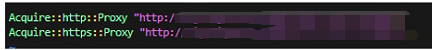

# 介绍
本文档为从0组建服务器到搭建Deepspeed框架的实践步骤。

# 硬件要求
deepspeed支持的GPU版本如下：
NVIDIA: Pascal, Volta, Ampere, and Hopper architectures
AMD: MI100 and MI200

# CUDA串网环境
为了构建一个干净的联网架构并方便调试，采用docker组网模式串联各服务器。

1.	为apt配置网络代理

在安装操作系统时进行配置就好
如要修改
```bash
cd /etc/apt/apt.conf.d/
ls
sudo vim proxy.conf （如果已有10proxy等则进去修改）
```



2.	安装nVidia驱动

卸载旧驱动
```bash
sudo apt –purge remove *nvidia*
sudo apt –purge remove *cublas*
sudo apt autoremove
```
查看本机支持驱动
```bash
ubuntu-drivers devices
```
安装驱动，以下指令二选一：
```bash
sudo ubuntu-drivers autoinstall
sudo apt install nvidia-driver-XXX
```

3.	安装docker

```bash
sudo apt install docker.io
sudo apt install docker-compose
```
此时运行docker images可能会出现权限限制
```bash
sudo usermod -a -G docker g3
sudo vim /usr/lib/systemd/system/docker.socket
```
将SocketMode=0660改为SocketMode=0666
重启docker
```bash
sudo systemctl daemon-reload
sudo systemctl restart docker.socket
```

4.	安装nvidia-docker2

```bash
distribution=$(. /etc/os-release;echo $ID$VERSION_ID)
curl -s -L https://nvidia.github.io/nvidia-docker/gpgkey | sudo apt-key add -
curl -s -L https://nvidia.github.io/nvidia-docker/$distribution/nvidia-docker.list | sudo tee /etc/apt/sources.list.d/nvidia-docker.list
```

注意当没有设置curl使用代理时无法正确更新源，表现形式为gpg: no valid OpenPGP data found。命令改为
```bash
http_proxy=代理设置
curl -s -L https://nvidia.github.io/nvidia-docker/gpgkey --proxy $http_proxy| sudo apt-key add -
curl -s -L https://nvidia.github.io/nvidia-docker/$distribution/nvidia-docker.list  --proxy $http_proxy | sudo tee /etc/apt/sources.list.d/nvidia-docker.list
```
```bash
sudo apt-get update
sudo apt-get install -y nvidia-docker2
sudo systemctl restart docker
```

5.	搭建nvidia-docker环境

经过尝试docker pull始终无法解决DNS、代理、镜像源三重限制造成的问题，采用手动拉取方案。
访问https://hub.docker.com/r/nvidia/cuda/
找到合适的镜像，注意选择带有所有内容的devel版本。复制其pull命令，如`docker pull nvidia/cuda:11.6.1-cudnn8-devel-ubuntu20.04`，在有网环境下进行：
```bash
docker pull nvidia/cuda:11.6.1-cudnn8-devel-ubuntu20.04
docker images 获取拉取的编号，采用hash较为确定
docker save 0000 > imagename.tar 其中0000为hash
将imagename.tar上传服务器
docker load < imagename.tar
docker images 获取加载的镜像hash
docker tag 0000 nvidia/cuda:版本
```
此时应该可以在容器内启动nvidia-smi，验证：
`docker run --rm --gpus all nvidia/cuda:版本 nvidia-smi`
这里可能出现容器内cuda版本与镜像不一致而与宿主机一致的情况，原因是驱动版本不支持对应的cuda版本

6.	构建docker VScode debug环境

在远程服务器上安装VScode插件，因为网络问题，同样选择上传安装：
搜索到插件，点击市场，下载插件，上传服务器。
扩展中选择从VSIX安装插件。
所需插件：
`remote development`
`docker`
安装好后，就可以在docker扩展中的右键容器选择 附加到VScode 从而进入容器（VSCode界面）。
进入容器后用同样的方式安装调试插件。
所需插件:
`python`

7.	构建docker组网

在主服务器上
`docker swarm init`

在副服务器上执行提示命令：
`docker swarm join --token 从上一条指令复制过来的TOKEN`
而后创建网络集群：
`docker network create --driver=overlay --attachable llm-net`
可以用`docker network ls`看到新建的组网
此时其他服务器并不能看见新创建的组网，需要运行
`docker run -dit --name test --network llm-net image_name bash`

8.	使用docker compose创建容器

创建Dockerfile文件，Dockerfile中可以执行一些固定的操作如apt install，但是保险起见我们先选择创建容器后执行这些命令：
```dockerfile
FROM nvidia/cuda:11.6.1-cudnn8-devel-ubuntu20.01

ENV http_proxy 网络代理设置
ENV https_proxy 网络代理设置
# 更新系统包
# RUN apt-get update && apt-get install -y git build-essential zlib1g-dev libncurses5-dev libgdbm-dev libnss3-dev libssl-dev libsqlite3-dev libreadline-dev libffi-dev liblzma-dev libbz2-dev curl wget net-tools iputils-ping pdsh openssh-server
```
创建compose.yaml文件：
```yaml
version: "3"
services:
  llm:
    build:
      context: .
      dockerfile: Dockerfile
    container_name: llm
    tty: true
    restart: always
    ulimits:
      memlock: -1
      stack: 67108864
    shm_size: 100G
    deploy:
      resources:
        reservations:
          devices:
            - capabilities: [gpu]
    volumes:
      - /home/llm:/home
    networks:
      llm-net:
        ipv4_address: 10.0.1.10
      

networks:
  llm-net:
    external: true
    ipam:
      config:
        - subnet: 10.0.1.0/24
```
ulimits中的stack指定了共享内存，对于大batch学习很重要。
启动容器
`docker-compose up -d`
在所有服务器上执行相同的操作，启动容器（适当更改对应的环境变量）
执行完后可以把之前创建的test容器删除了
```bash
docker container stop test
docker contrianer rm test
```
此时可以测试一下组网内的容器是否联通，inspect容器可以在Networks中看到IPAMConfig中IPv4地址。
 
然后用另一个容器ping一下。

下面的操作都在容器内进行了，此时使用VSCode进入各容器方便操作。

9.	开启容器间ssh免密访问

对各容器执行
```bash
apt-get install openssh-server -y
/etc/init.d/ssh start
ssh-keygen
```
将主机A中的~/.ssh/id_rsa.pub复制到所有节点的~/.ssh/authorized_keys中（包括自己）
可以向/etc/hosts文件中添加映射别名以方便后续的ssh操作，不添加也行（如不添加，后续的ssh操作均使用IP地址指定容器。
使用ssh让容器都相互访问一下，从而信任相互证书。

10.	 配置NCCL网络

NCCL是nvidia的多卡通信框架，先用`ifconfig`查看使用的网卡，如eth0，将其写入`/etc/profile`
```profile
export NCCL_SOCKET_IFNAME=eth0
```
使配置生效
`source /etc/profile`
该操作重复到各容器中
到此，组网串接完成，接下来进行python环境安装

11.	容器内安装VSCode python插件

见6.

12.	安装python，pip更换apt、pip源

apt换源：
`vim /etc/apt/sources.list`
修改为
```txt
deb http://mirrors.aliyun.com/ubuntu/ focal main restricted universe multiverse
deb-src http://mirrors.aliyun.com/ubuntu/ focal main restricted universe multiverse
deb http://mirrors.aliyun.com/ubuntu/ focal-security main restricted universe multiverse
deb-src http://mirrors.aliyun.com/ubuntu/ focal-security main restricted universe multiverse
deb http://mirrors.aliyun.com/ubuntu/ focal-updates main restricted universe multiverse
deb-src http://mirrors.aliyun.com/ubuntu/ focal-updates main restricted universe multiverse
deb http://mirrors.aliyun.com/ubuntu/ focal-backports main restricted universe multiverse
deb-src http://mirrors.aliyun.com/ubuntu/ focal-backports main restricted universe multiverse
deb http://mirrors.aliyun.com/ubuntu/ focal-proposed main restricted universe multiverse
deb-src http://mirrors.aliyun.com/ubuntu/ focal-proposed main restricted universe multiverse
```
`apt-get update`
要安装高版本的python，首先需要更新软件源
```bash
apt install software-properties-common -y
add-apt-repository ppa:deadsnakes/ppa
apt install python3.11
apt install python3.11-full
apt install python3.11-dev
wget https://bootstrap.pypa.io/get-pip.py
python3.11 get-pip.py
```
创建python软链接
`ln -s $(which python3.11) /bin/python`
更改软件源
```bash
cd ~
mkdir pip
vim pip.ini
```
```txt
[global]
index-url = https://pypi.tuna.tsinghua.edu.cn/simple
[install]
trusted-host = https://pypi.tuna.tsinghua.edu.cn
```

# Deepspeed训练框架

13.	模型与训练框架下载

模型采用llama3-8b-instruction，https://www.modelscope.cn/models/LLM-Research/Meta-Llama-3-8B-Instruct/summary
训练框架采用deepspeed，https://github.com/microsoft/DeepSpeedExamples/tree/master/applications/DeepSpeed-Chat 
测试数据集采用Dahoas/rm-static，https://huggingface.co/datasets/Dahoas/rm-static 
用VSCode直接把下载好的东西复制到容器里。

14.	python库补齐

采用DeepSpeedExamples-master/applications/DeepSpeed-Chat环境
`pip install torch torchvision torchaudio`
直接安装的deepspeed调试时可能会出BUG，使用源码安装
修改git的代理
```bash
git config --global http.proxy $http_proxy
git config --global https.proxy $http_proxy
```
下载源码
```bash
git clone https://github.com/microsoft/DeepSpeed.git
cd DeepSpeed
pip install -r 'requirements/requirements-dev.txt'
DS_BUILD_OPS=1 pip3 install .
```
此时可能报错找不到Python.h，Python.h一般在安装python-dev后会出现在/usr/include中，找不到的原因是文件在进一步的python3.11子文件夹中，进入/usr/local/lib/python3.11/dist-packages/torch/include/torch/csrc/python_headers.h文件，将其中的<Python.h>改为<python3.11/Python.h>就行
其他包直接安装
`pip install -r requirements.txt`

15.	配置deepspeed调试环境

VScode的F5可以帮助我们调试，但是deepspeed的命令行格式为deepspeed main.py，可以通过设置launch.json进行调试
点击右上角
   
修改launch.json内容为类似下列内容
```json
{
    "version": "0.2.0",
    "configurations": [
        {
            "name": "Python 调试程序: 当前文件",
            "type": "python",
            "request": "launch",
            "program": "deepspeed",
            "console": "integratedTerminal",
            "justMyCode": true,
            "args": [
                "/root/DeepSpeedExamples-master/applications/DeepSpeed-Chat/training/step1_supervised_finetuning/main.py",
                "--data_path Dahoas/rm-static","Dahoas/full-hh-rlhf",
                "--data_split","2,4,4",
                "--model_name_or_path","/root/Meta-Llama-3-8B-Instruct",
                "--per_device_train_batch_size","4",
                "--per_device_eval_batch_size","4",
                "--max_seq_len","512",
                "--learning_rate","1e-4",
                "--weight_decay","0.1",
                "--num_train_epochs"," ",
                "--gradient_accumulation_steps","1",
                "--lr_scheduler_type","cosine",
                "--num_warmup_steps","0",
                "--seed","1234",
                "--gradient_checkpointing",
                "--zero_stage","3",
                "--lora_dim","128",
                "--lora_module_name","decoder.layers.",
                "--deepspeed"
            ]
        }
    ]
}
```
（deepspeed需要绝对路径，使用whereis获取位置）
作为对比，下面展示相同的程序在命令行中的样子（一些参数有点变动）：
```bash
deepspeed main.py \
   --data_path Dahoas/rm-static\
   --data_split 2,4,4 \
   --model_name_or_path facebook/opt-66b \
   --per_device_train_batch_size 4 \
   --per_device_eval_batch_size 4 \
   --max_seq_len 512 \
   --learning_rate 1e-4 \
   --weight_decay 0.1 \
   --num_train_epochs 2  \
   --gradient_accumulation_steps 1 \
   --lr_scheduler_type cosine \
   --num_warmup_steps 0 \
   --seed 1234 \
   --gradient_checkpointing \
   --zero_stage $ZERO_STAGE \
   --lora_dim 128 \
   --lora_module_name decoder.layers. \
   --deepspeed \
   --output_dir $OUTPUT \
```

16.	配置deepspeed联机环境

创建hostfile文件，该文件用于告诉deepspeed各节点上的显卡分布。在host中设置过别名的在这里可以使用别名。
 
创建ds_config.json文件，该文件用于告诉deepspeed训练设置，当没有该文件时可以留空使用默认。
```json
{
    "train_batch_size": "auto",
    "train_micro_batch_size_per_gpu": "auto",
    "gradient_accumulation_steps": "auto",
    "gradient_clipping": "auto",
    "zero_allow_untested_optimizer": true,
    "fp16": {
      "enabled": "auto",
      "loss_scale": 0,
      "initial_scale_power": 16,
      "loss_scale_window": 1000,
      "hysteresis": 2,
      "min_loss_scale": 1
    },
    "zero_optimization": {
      "stage": 3,
      "allgather_partitions": true,
      "allgather_bucket_size": 5e8,
      "reduce_scatter": true,
      "reduce_bucket_size": 5e8,
      "overlap_comm": false,
      "contiguous_gradients": true
    }
  }
```
在launch.json中使用"--hostfile","/root/hostfile",和"--deepspeed","/root/ds_config.json"激活设置，注意hostfile是deepspeed的参数，因此要放在main.py前面

17.	在manger容器中点击F5，开始调试！
